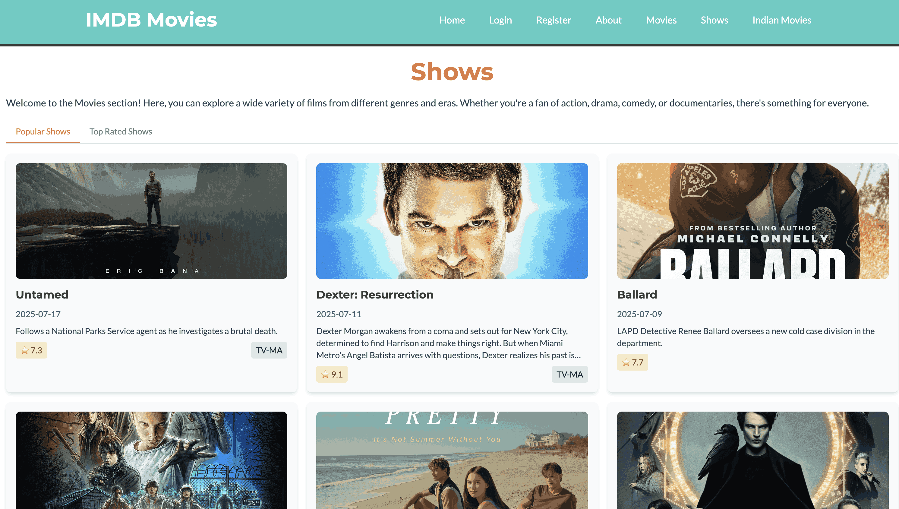

# Vue Dino App

A simple dinosaur info app to show dino data in form of table using ag-grid and related libraries.


## Table of Contents
1. [Project Briefing](#project-briefing)
2. [Technologies Used](#technologies-used)
3. [Screenshots](#screenshots)
4. [Updates](#updates)
5. [Thank You](#thank-you)

## Project Briefing
Vue Dino App is a simple and interactive application built using Vue 3 and Vite. The app demonstrates modern front-end development practices and serves as a starting point for developers exploring Vue 3's `<script setup>` syntax.

I wanted to test ag-grid community edition for Vue so that is how this project came into existence. Ag-grid makes it easy to sort and filter by individual columns in a table. Below is the sample code used from ag-grid library to display dinosaurs in tabular format, sorting is enabled on all columns plus there is custom theme.

```Vue
<ag-grid-vue
    v-if="dinosaurData"
    class="ag-theme-alpine"
    style="width: 100%; height: 400px"
    :columnDefs="columnDefs"
    :rowData="dinosaurData.results"
    :modules="modules"
    :defaultColDef="defaultColDef"
    :gridOptions="gridOptions"
    @grid-ready="onGridReady"
/>

import "@ag-grid-community/styles/ag-grid.css";
import "@ag-grid-community/styles/ag-theme-alpine.css";
import { ClientSideRowModelModule } from "@ag-grid-community/client-side-row-model";
import { AgGridVue } from "@ag-grid-community/vue3";

const modules = ref([ClientSideRowModelModule]);

// ag grid config
const columnDefs = ref([
  { field: "id", headerName: "ID", sortable: true, filter: true },
  { field: "name", headerName: "Name", sortable: true, filter: true },
  { field: "diet", headerName: "Diet", sortable: true, filter: true },
  { field: "period", headerName: "Period", sortable: true, filter: true },
  { field: "lived_in", headerName: "Lived In", sortable: true, filter: true },
  { field: "type", headerName: "Type", sortable: true, filter: true },
  { field: "length", headerName: "Length", sortable: true, filter: true },
  { field: "taxonomy", headerName: "Taxonomy", sortable: true, filter: true },
  { field: "named_by", headerName: "Named By", sortable: true, filter: true },
  { field: "species", headerName: "Species", sortable: true, filter: true },
]);

const defaultColDef = ref({
  flex: 1,
  minWidth: 100,
  resizable: true,
});

const gridOptions = ref({
  animateRows: true,
  rowHeight: 50,
  headerHeight: 50,
});

const customTheme = ref({
  header: {
    backgroundColor: "#1D1616",
    color: "#FFF",
  },
});
```

On grid ready is the function triggered to change the default styles of ag-grid when it becomes part of the DOM.

## Technologies Used
- Vue 3
- Vite
- JavaScript (ES6+)
- HTML5
- CSS3

## Writing Test cases

Test cases are written using Vitest framework. Install the related dependencies for the testing framework and tweak vite config settings.

```
import { defineConfig } from 'vite'
import vue from '@vitejs/plugin-vue'

// https://vite.dev/config/
export default defineConfig({
  plugins: [vue()],
  test: {
    environment: 'happy-dom',
  },
  server: {
    port: 8080
  }
})
```

## Screenshots

Only one screenshot is added, it is from the homepage and shows the tabular view of Dinosaur.



## Updates
- **v1.0.0**: Initial release with basic functionality.
- **v1.1.0**: Added new features and improved performance.

## Thank You
Thank you for exploring the Vue Dino App! Feel free to contribute or provide feedback to help improve the project. If you liked this project consider giving it a ⭐

Learn more about IDE Support for Vue in the [Vue Docs Scaling up Guide](https://vuejs.org/guide/scaling-up/tooling.html#ide-support).
